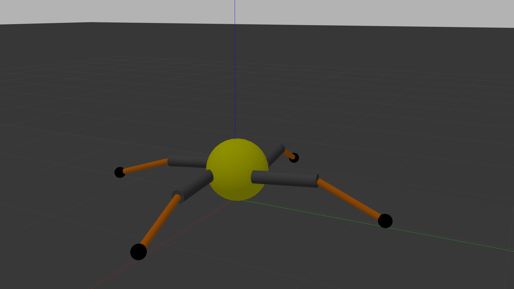

# Intro

This is a simple 4-leg robot simulation model and integrated with reinforcement learning algorithm. Each of its leg has 2 DOF. The simulation platform is [Gazebo](http://gazebosim.org/) using [ROS](https://www.ros.org/) control and [openai_ros](http://wiki.ros.org/openai_ros) to integrate the model with the RL framework [Gym](https://gym.openai.com/).

# Environment Setup

- ubuntu 20.04 (with only python3)
- ROS-Noetic ([Installation guide](http://wiki.ros.org/noetic/Installation/Ubuntu))
    - Gazebo (contained in the `ros-noetic-desktop-full` in the above guide)
    - effort controller `sudo apt install ros-neotic-effort-controller`
    - velocity controller `sudo apt install ros-neotic-velocity-controller`
    - position controller `sudo apt install ros-neotic-position-controller`
- Gym version 0.17.2 `pip install gym`

Remember follow [this guide](http://wiki.ros.org/ROS/Tutorials/InstallingandConfiguringROSEnvironment) to create a ROS workspace. e.g. `~/catkin_ws`

Clone the repo and move it to `~/catkin_ws/src`

# Usage

Firstly, run the simulation, cmd in `[]` is optional  
`roslaunch crawler world.launch [gui:=false]`

Then run the training script in the `script` dir.  
Both `rosrun crawler start_training.py` and `python start_training.py` work